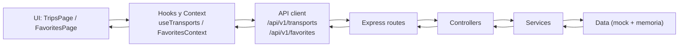

# Diseño y arquitectura de TransitFlow

## 1. Estructura general

TransitFlow está organizado en dos capas dentro del mismo repositorio:

- Frontend: React + TypeScript + Tailwind + React Router
- Backend: Node.js + Express (API REST)

La arquitectura del backend sigue separación por capas:

- `routes`: define endpoints y mapeo de rutas
- `controllers`: recibe request/response y valida entradas básicas
- `services`: lógica de negocio
- `data`: datos mock y almacenamiento en memoria
- `types`: contratos tipados
- `config`: configuración de entorno

## 2. Componentes principales y reutilización

### Frontend

- `Header`: navegación principal (dashboard/sidebar responsive)
- `TransportCard`: tarjeta reutilizable para mostrar un trayecto
- `EmptyState`: estado vacío reutilizable
- `TripsPage`: listado, búsqueda y filtros de transportes
- `FavoritesPage`: listado de favoritos reutilizando `TransportCard`

### Backend

- Módulo `transports`: lectura de trayectos mock
- Módulo `favorites`: favoritos en memoria (sin base de datos)

## 3. Gestión de estado

Se utiliza una combinación de estado local y estado compartido:

- Estado local por página/componente: búsqueda, filtros, loading/error de consultas
- Estado global con Context API:
  - `FavoritesContext`: ids favoritos, carga inicial y operaciones toggle

## 4. API REST (recursos, verbos y contratos)

Base path: `/api/v1`

### Transportes

- `GET /api/v1/transports`
  - Respuesta: `Transport[]`
- `GET /api/v1/transports/:id`
  - Respuesta: `Transport`
  - `404` si no existe

### Favoritos

- `GET /api/v1/favorites`
  - Respuesta: `string[]` (ids de transportes)
- `POST /api/v1/favorites`
  - Body: `{ "id": "train-101" }`
  - Respuesta: `string[]` actualizado
- `DELETE /api/v1/favorites/:id`
  - Respuesta: `string[]` actualizado

### Contrato `Transport`

```ts
{
  id: string
  type: 'bus' | 'train' | 'flight'
  company: string
  origin: string
  destination: string
  scheduledTime: string
  estimatedTime: string
  status: 'on_time' | 'delayed' | 'boarding'
  locationLabel: string
}
```

## 5. Persistencia de datos

- Persistido en servidor: actualmente no hay persistencia duradera (favoritos en memoria, se reinician al apagar backend).
- Persistido en cliente: no se usa persistencia local para favoritos en la versión actual (se sincroniza con API en memoria).

## 6. Flujo de datos (frontend ↔ API ↔ backend)



## 7. Decisiones clave

- API versionada con `/api/v1` para facilitar evolución futura.
- Tipado fuerte compartido por dominio de transportes para evitar errores de contrato.
- Reutilización de `TransportCard` para mantener consistencia visual y reducir duplicación.
- Separación clara de lógica de datos (hooks/context) y presentación (componentes).
