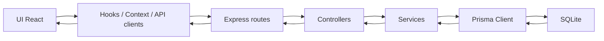

# Diseno y arquitectura de TransitFlow

## Estructura general

TransitFlow mantiene frontend y backend en el mismo repositorio:

- Frontend: React + TypeScript + Tailwind + React Router
- Backend: Node.js + Express
- Persistencia: Prisma + SQLite

La arquitectura del backend sigue separacion por capas:

- `routes`: define endpoints REST
- `controllers`: recibe request/response
- `services`: contiene la logica de negocio
- `lib`: cliente Prisma y seed inicial
- `types`: contratos tipados del backend

## Dominio actual

La aplicacion esta centrada en planificacion de viajes. Las entidades principales son:

- `Trip`
- `Place`
- `Expense`
- `Saving`
- `Note`
- `Favorite`

## Modelo de datos

### `Trip`
- `id`
- `name`
- `destination`
- `startDate`
- `endDate`
- `budget`
- `image?`

### `Place`
- `id`
- `tripId`
- `name`
- `category`
- `notes`

### `Expense`
- `id`
- `tripId`
- `type`
- `amount`

### `Saving`
- `id`
- `tripId`
- `amount`
- `date`

### `Note`
- `id`
- `tripId`
- `text`
- `createdAt`

## Persistencia

- Prisma es la capa de acceso a datos
- SQLite es la base de datos local del proyecto
- Hay un seed inicial que solo se ejecuta una vez y deja datos de ejemplo
- El backend es la unica fuente de verdad
- El frontend ya no usa `localStorage` como fuente de datos

## API REST

Base path: `/api/v1`

### Trips
- `GET /api/v1/trips`
- `GET /api/v1/trips/:id`
- `POST /api/v1/trips`
- `PUT /api/v1/trips/:id`
- `DELETE /api/v1/trips/:id`

### Places
- `GET /api/v1/places?tripId=...`
- `POST /api/v1/places`
- `PUT /api/v1/places/:id`
- `DELETE /api/v1/places/:id`

### Expenses
- `GET /api/v1/expenses?tripId=...`
- `POST /api/v1/expenses`
- `PUT /api/v1/expenses/:id`
- `DELETE /api/v1/expenses/:id`

### Savings
- `GET /api/v1/savings?tripId=...`
- `POST /api/v1/savings`
- `PUT /api/v1/savings/:id`
- `DELETE /api/v1/savings/:id`

### Notes
- `GET /api/v1/notes?tripId=...`
- `POST /api/v1/notes`
- `PUT /api/v1/notes/:id`
- `DELETE /api/v1/notes/:id`

### Favorites
- `GET /api/v1/favorites`
- `POST /api/v1/favorites`
- `DELETE /api/v1/favorites/:id`

## Swagger

La API queda documentada con Swagger UI en:

- `/api/docs`
- `/api/docs.json`

## Flujo de datos

## Decisiones actuales

- Mantener React + Express en el mismo repo para simplificar el desarrollo
- Usar Prisma + SQLite para persistencia real sin complicar despliegue local
- Reutilizar un layout dashboard para no rehacer la app visualmente
- Priorizar CRUD real y consistencia de datos sobre integraciones externas
